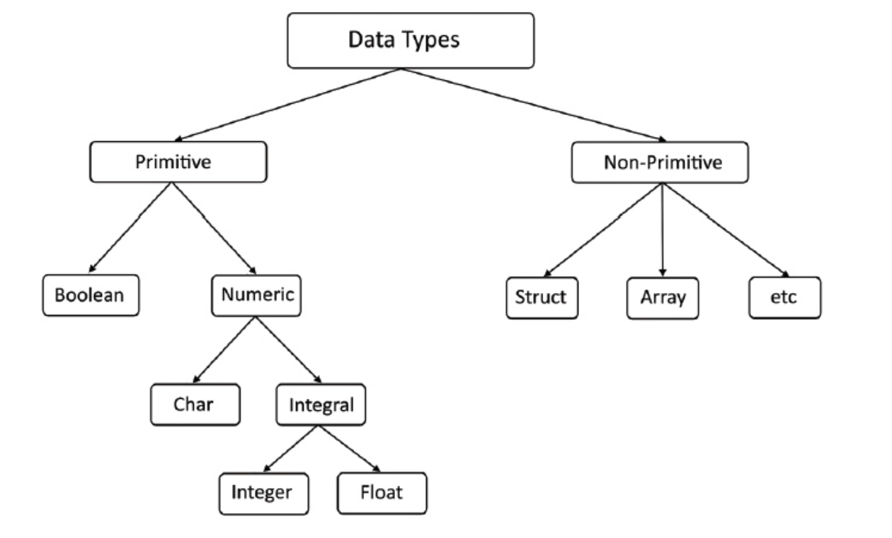

# Rust 基础知识

Rust数据类型包含了原语和非原语（组合数据类型）。



## 原语

原语包括了符号整形（signed int）、无符号整形（unsigned int）、浮点型（float）、单字符（char）、布尔型（bool）、单元类型（括号）。

### 介绍变量

``` 
    let pi: f64 = 3.14
```
上面定义，介绍如下。
- let: 定义变量的关键字
- pi： 变量名称
- f64: 浮点类型--64位
- 3.14: 浮点类型的值， 以栈（stack）形式进行存储

默认情况下，Rust变量是不可变的。如果需要修改变量的值，可以加mut 修饰符。

``` 
    let mut count = 0;
```

上面定义的变量count就是一个可以修改值的可变变量。

``` 
    let mut ticket = 0;   // 初始化定义
    println!("init ticket count: {}", ticket); // 打印操作 0
    ticket += 1;  // 逻辑增加1
    println!("update ticket count: {}", ticket); // 打印操作 1
```

### 常量

常量是不可变的，不允许将mut 修饰常量。

``` 
const MAX_REQUEST: u32 = 2_000_000;
```

## 所有权、借用和生命周期

所有权，借用和生命周期是Rust 编程的核心思想。`Rust` 的所有权、借用和生命周期 致力于确保安全的内存使用。

### 所有权
所有权是一个基本概念，它发挥着在有效管理记忆和预防记忆方面发挥着关键作用常见的错误，例如内存泄漏和悬空指针。

Rust的所有权的中心思想是 Rust 中的每个值都有一个“所有者” ，它负责在没有内存时取消分配其内存。 这种方法确保内存以受控方式发布，避免了缺陷的存
在，规避了手动内存管理。当变量超出范围时，Rust 的所有权系统 自动调用drop掉函数，释放内存中所使用的值。 这消除了显式的需要内存释放，大大降低了
内存泄漏风险 。

``` 
let lang = String::from(“Rust Programming!”);
// … do something with ‘lang’
// ‘lang’ goes out of scope, and memory is deallocated
```


### 借用

虽然所有权为记忆提供了坚实的基础安全，当您想要时，有时可能会受到限制代码的各个部分之间共享数据。 这就是借用的概念开始发挥作用。 借用允许您的代
码的多个部分无需使用即可访问数据所有权。

借用检查器分析之间的关系、代码中的变量、引用和所有权，以防止常见问题。例如，悬空引用。

``` 
    fn calculate_length(s: &String) -> usize { // ②
        s.len()
    }

    let s1 = String::from("A simple borrowing");
    let len = calculate_length(&s1); // ①
    println!("Length of ‘{}’: {}", s1, len);
```


### 生命周期