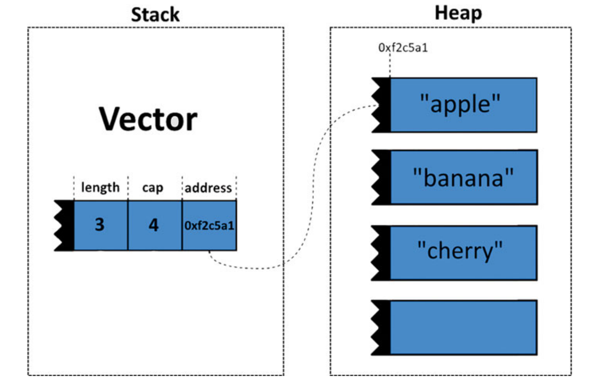
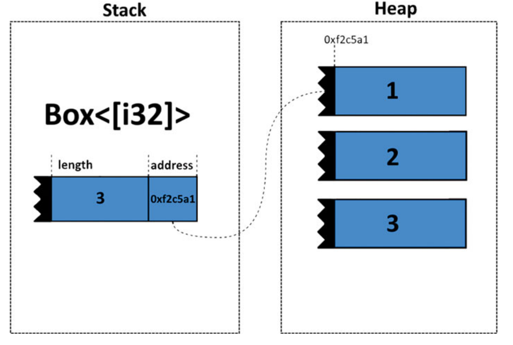

# Memory Management and Pointers

Within the world of programming languages, Rust emerges as a distinctive force, often hailed as a systems
programming language. It boldly endeavors to provide us with a unique blend of high-level control over memory while
firmly endorsing the twin pillars of safety and reliability. In this journey through Rust’s memory management landscape,
you’ll uncover why this language places memory management at its very core. Rust’s design philosophy
revolves around empowering us to utilize memory with precision, avoiding the pitfalls that have cursed languages of
the past. It is the fusion of control and safety that sets Rust apart and makes it a compelling choice for us seeking to
create robust and efficient software systems.

``` 
let s1 = String::from(“hello”);
let s2 = s1; // ①
// println!(“s1: {}”, s1); // ②
println!(“s2: {}”, s2); // ③
```

① s1’s ownership is transferred to s2.
② This line would result in a compilation error.
③ s2 can still be used.

Understanding when to use ownership, borrowing(references with &), and mutable borrowing (references with
&mut) is essential for managing memory efficiently and avoiding issues like use-after-free errors or unnecessary data
copying.

``` 
  let mut numbers = vec![1, 2, 3, 4, 5];
  let mut_ptr = numbers.as_mut_ptr(); // ①
  let len = numbers.len();
  unsafe { // ②
  for i in 0..len {
  let current_value = *mut_ptr.add(i); // ③
  *mut_ptr.add(i) = current_value * 2; // ④
  }
  }
  println!(“{:?}”, numbers);
```


## Stack versus Heap



The stack, a memory region characterized by its orderliness
and efficiency, operates under a strict last-in, first-out (LIFO)
discipline. It serves as the go-to destination for managing
short-lived variables, such as those within the scope of a
function call. When a function is invoked, its local variables are allocated on the stack, ensuring that they are
automatically deallocated when the function exits. This
simplicity and predictability make the stack an important
resource for the compiler, enabling it to optimize memory
allocation for permanent data.

In contrast, the heap represents a world of flexibility and
dynamic memory allocation. Values residing in the heap can
be allocated and deallocated at arbitrary times during a
program’s execution, providing a space for long-lived data
structures that outlive their creating scope. Rust’s ability to
seamlessly navigate the transition between stack and heap,
allocating values efficiently on the stack while going into the
heap when necessary, showcases the language’s ability in
striking a balance between performance and memory
management.

## Pointers and Smart Pointers

Rust 中的所有值默认都是堆栈分配的。 可以通过创建 Box<T> 将值装箱（在堆上分配）。

### Box
`box `分配内存到堆（heap）上。



`Box<T>` 内存布局

Box allows you to allocate memory for a known type and place it on the heap. This heap-allocated value is then owned
by the Box, which automatically deallocates the memory when it goes out of scope.

`Box `功能性可以应用到下列场景中。
- 管理具有可变大小的动态数据结构 
- 确保值超出其范围，即使已传递到其他功能，无需转移复杂数据结构的所有权
- 昂贵的复制操作

`Rust `通过 Box 提供了一个能够平衡处理堆分配的灵活性和安全性的内存管理解决方案。

### Rc

Rc 是引用计数器（Reference Counter）的缩写，引入了共享所有权。

``` 
    let data = Rc::new(vec![1, 2, 3, 4, 5]); // ①
    let clone1 = Rc::clone(&data); // ②
    let clone2 = Rc::clone(&data); // ②
    let sum: i32 = data.iter().sum(); // ③
    println!("Data: {:?}", data);
    println!("Clone1: {:?}", clone1);
    println!("Clone2: {:?}", clone2);
```
Rc 提供了一种让多个读者读取相同数据的方法，使其适用于您想要共享数据的场景。 在程序的不同部分之间， 然而，它是
需要注意的是，Rc 不保证线程安全。 如果 你需要跨多个线程共享所有权，你应考虑使用 Arc（原子引用计数器， Atomic Reference Counter） 那个目的。

### Arc

Arc（原子引用计数器， Atomic Reference Counter）是`Rc` 的兄弟姐妹，允许多个所有者共享相同的数据，用在多线程场景。
``` 
    let data = Arc::new(vec![1, 2, 3, 4, 5]); // ①
    let clone1 = Arc::clone(&data); // ②
    let clone2 = Arc::clone(&data); // ②
    let handle1 = thread::spawn(move || { // ③
        let sum: i32 = clone1.iter().sum();
        println!("Thread 1 - Sum of Data: {}", sum);
    });
    let handle2 = thread::spawn(move || { // ③
        let product: i32 = clone2.iter().product();
        println!("Thread 2 - Product of Data: {}", product);
    });
    handle1.join().unwrap();
    handle2.join().unwrap();
```
Arc在并发编程中特别有价值， 确保多个线程安全地访问数据。 它是原子引用计数保证引用和释放以线程安全的方式处理，使得
多线程共享数据的绝佳选择环境。

### RefCell

Rust 对可变性的严格规则确保了安全性和您的代码的完整性。 然而，也有一些情况, 即使在上下文中，您也需要对数据进行改变，
否则，被认为是不可变的。 这是哪里 `RefCell` 可作为动态可变的有用工具。

``` 
    let data = RefCell::new(vec![1, 2, 3]);
    let data_ref = data.borrow(); // ①
    // data_ref.push(4); // ②
    drop(data_ref); // ③
    let mut data_ref_mut = data.borrow_mut(); // ④
    data_ref_mut.push(4); // ⑤
    println!(“Modified Data: {:?}”, *data_ref_mut); // ⑥
```

① Borrowing an immutable reference.
② Attempting to mutate the data (will panic at runtime).
③ Dropping the immutable reference.
④ Borrowing a mutable reference.
⑤ Mutate the data safely.
⑥ Accessing the modified data.

RefCell 使用场景。
- 使用闭包：它允许您改变数据 在捕获不可变引用的闭包中。 
- 内部可变性：方便实现数据具有内部可变性的结构，例如，图算法或自定义智能指针。 
- 单线程上下文：当借用规则是在单线程上下文中限制太多，RefCell 促进数据共享。

### Mutex

`Rust` 提供了 `Mutex` 智能指针作为实现这一目标的强大工具。 `Mutex` 代表互斥并提供独占、
同步访问共享数据，保证线程安全和数据完整性。

``` 
use std::sync::{Mutex};
use std::time::Duration;
struct Bank {
    accounts: Mutex<HashMap<String, f64>>,
}
impl Bank {
    fn new() -> Self {
        Bank {
            accounts: Mutex::new(HashMap::new()),
        }
    }
    fn deposit(&self, account: &str, amount: f64) {
        let mut accounts = self.accounts.lock().unwrap();
        let balance =
            accounts.entry(account.to_string()).or_insert(0.0);
        *balance += amount;
    }
    fn withdraw(&self, account: &str, amount: f64) {
        let mut accounts = self.accounts.lock().unwrap();
        let balance =
            accounts.entry(account.to_string()).or_insert(0.0);
        if *balance >= amount {
            *balance -= amount;
        } else {
            println!("Insufficient funds for account: {}", account);
        }
    }
    fn check_balance(&self, account: &str) -> f64 {
        let accounts = self.accounts.lock().unwrap();
        *accounts.get(account).unwrap_or(&0.0)
    }
}

fn main() {
    let bank = Arc::new(Bank::new());
    let mut handles = vec![];
    for i in 0..5 {
        let bank_clone = Arc::clone(&bank);
        let handle = thread::spawn(move || {
            let account = format!("Account{}", i);
            bank_clone.deposit(&account, 100.0);
            thread::sleep(Duration::from_millis(100)); // Simulate
            bank_clone.withdraw(&account, 30.0);
            let balance = bank_clone.check_balance(&account);
            println!("{} - Balance: {:.2}", account, balance);
        });
        handles.push(handle);
    }
    for handle in handles {
        handle.join().unwrap();
    }
}
// end
```

Mutex 是一种很有价值的工具，用于保护多线程 Rust 程序中的共享数据，保证只有一个线程可以随时修改它。 然而，有必要的是
谨慎使用互斥体以避免不必要的争用访问，这可能会影响性能。 主要是重读操作的使用场景中，请考虑使用` RwLock<T> `用于提
高并发性。

### RwLock

RwLock（Read-Write Lock，读写锁）在多线程中起着至关重要的作用
Rust 编程通过提供平衡的方法管理共享数据。

在决定使用 Mutex<T> 还是 RwLock<T> 时，请考虑
您共享数据的性质：
- Mutex<T>：当您的数据遇到问题时，选择 Mutex<T>频繁更新，保持数据一致性 通过独占访问至关重要。 当管理单独的读锁和写锁的复杂性 
  并不能通过性能提升来证明其合理性。 
- RwLock<T>：如果您的数据读取次数比实际读取次数多写入，并且读取冲突的成本是一个问题，RwLock<T> 提供了一种更有效的方法。 允许
  多个并发读者可以显着提高此类场景中的性能。

## Atomic

在并发编程中，当多个线程访问时并同时修改共享数据，这一点至关重要确保这些操作是原子的。 一个原子操作意味着它似乎是瞬时发生的从其他线程的角度来看，
没有任何交错或部分完成的步骤。 Rust 提供通过其标准对原子操作的强大支持库，使您能够编写安全高效的并发代码。

std::sync::atomic 模块提供了全面的针对不同数据选择原子类型和操作类型。

